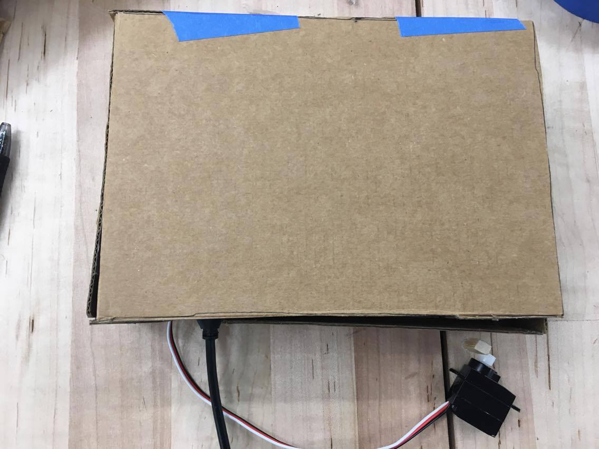
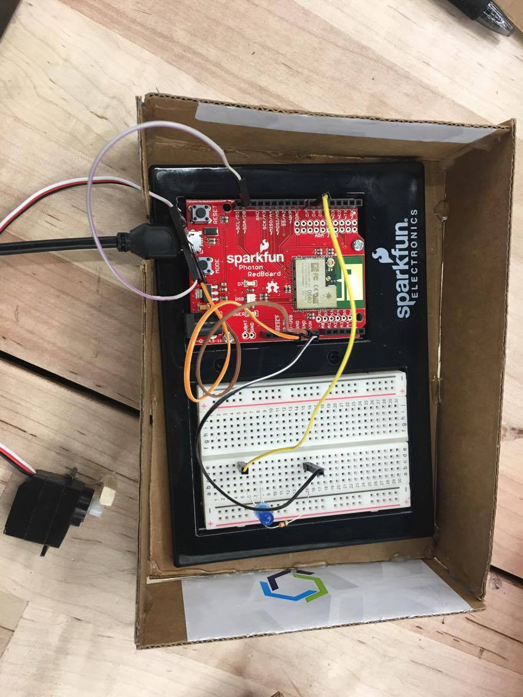

# Midterm IoT Project

Name:  Jiwon (Joyce) Choi

Date: 10/12/17

## Project: It's Lit

### Conceptual Description

My project, Its Lit, is a servo to press my light button in the morning based on input it gets from Will's project which detects when the light outside is light enough, signaling that it's day time. This project was to help me not sleep in. The key issues it engages is data security/ownership of data from Internet of Things devices. When the servo moves to turn on my lights, it also sends me (the user) an email about the information it used (when the switch was turned on). It also sends this information to my partners, signaling an LED on theirs. This simulates 3rd parties getting information from IoT devices and the user not knowing about this. In the email that the user receives here though, it says, the 3rd parties have also received the same information. This is the "gotcha" moment to the user that they are trading data privacy for convenience. This is often hidden from the user in most IoT devices. It leads to privacy issues if sensitive information like this is hacked. This project is a prototype of the IoT lights that are used in the real world where more information is collected about the user like when the user is active in the house. This information could help lead to more robberies if 3rd parties are given access to this data and this data is hacked and misused. 


### Form

/// Your project should be embodied in a ***physical form*** that reflects, embodies, and/or amplifies those your project's main concepts and ideas.
Explain your design choices here and include images that document your project's material embodiment. ///

**Finished Enclosure:**

For the enclosure, I made the design choice to make it enclosed except for the power cable and the servo motor. This is because the servo motor needs to be near my light switch to press it.


**Electronics Exposed:**



### Technical Details
//   
Here you should give an overview of the technical operation of your device, including:
* A wiring diagram
* list of hardware used
* Explanation of your
* Link to code   

Wiring diagram: 

List of hardware used: Servo motor, wires, blue LED, 330 ohms, power cable, power rod (portable charging rod), Photon board

Link to code: 

//

You can include code snippets here:

```
Particle.subscribe("Execute", messageParse, MY_DEVICES);
```

but also link to your project's full code in this repository:  [photon.ino](photon.ino)

**Wiring Diagram**


